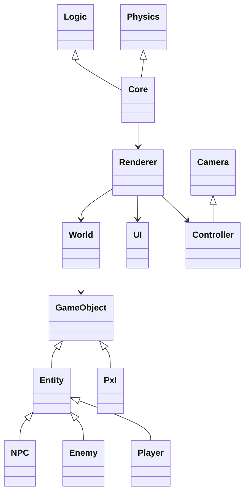

# Pxl

Pxl is small simple game engine is built ontop of SDL2, it features a component-based architecture divided into several components.

### Logic

The Logic component of the Pxl game engine is responsible for handling the game's logic. This includes things like game mechanics, AI, and game rules.

### Physics

The Physics component of the Pxl game engine is responsible for handling the game's physics. This includes things like collisions, movement, and gravity.

### Core

The Core component of the Pxl game engine is responsible for providing a foundation for the other components. This includes things like data structures, memory management, and threading.

### Renderer

The Renderer component of the Pxl game engine is responsible for rendering the game world. This includes things like lighting, shaders, and textures.

### UI

The UI component of the Pxl game engine is responsible for providing a user interface for the game. This includes things like menus, buttons, and HUD elements.

### Controller

The Controller component of the Pxl game engine is responsible for handling user input. This includes things like keyboard input, mouse input, and gamepad input.

